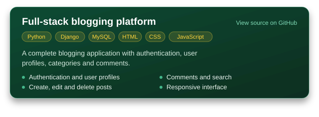
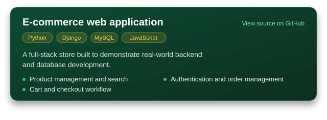
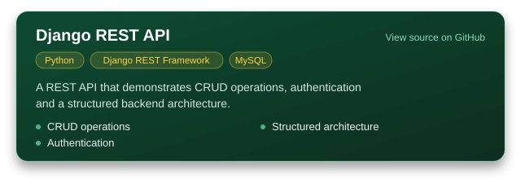

<!--
  Before you commit
  1. Replace YOUR_USERNAME, YOUR_LINKEDIN_USERNAME and YOUR_EMAIL@gmail.com.
  2. Name this repository exactly like your GitHub username so it shows on your profile.
  3. Put the three project card SVGs in an "assets" folder in this repository.
  4. Add the snake workflow (.github/workflows/snake.yml) and run it once.
  Palette: Django green 0C4B33, Python yellow FFD43B, badge ink 14261E.
-->

<div align="center">


<picture>
  <source media="(prefers-color-scheme: dark)" srcset="https://readme-typing-svg.demolab.com?font=Fira+Code&weight=500&size=17&duration=3200&pause=1400&color=FFD43B&center=true&vCenter=true&width=520&height=40&lines=I+build+web+applications+with+Python+and+Django;I+design+REST+APIs+and+relational+databases;I+turn+what+I+learn+into+working+projects">
  
</picture>

</div>

> [!TIP]
> Open to entry-level Python and Django developer roles. LinkedIn or email is the best way to reach me.

## About

I'm a Python full-stack developer focused on Django, REST APIs and database design. I like building complete applications, from the schema to the interface, and I learn fastest by turning concepts into working projects.

```python
class Developer:
    name = "Mayank Singh"
    role = "Python Full-Stack Developer"

    interests = ["Backend engineering", "REST API development", "Database design"]
    learning = ["Advanced Django", "Django REST Framework", "JavaScript", "React.js", "System design"]

    goal = "Build useful products and grow into a strong software engineer"

    def motto(self) -> str:
        return "Code. Learn. Build. Repeat."
```

## Tech stack

<p>
  <b>Backend</b><br>
  <picture>
    <source media="(prefers-color-scheme: dark)" srcset="https://skillicons.dev/icons?i=py,django&theme=dark">
    
  </picture><br>
  <sub>Python, Django, Django REST Framework</sub>
</p>

<p>
  <b>Frontend</b><br>
  <picture>
    <source media="(prefers-color-scheme: dark)" srcset="https://skillicons.dev/icons?i=html,css,js,react&theme=dark">
    
  </picture><br>
  <sub>HTML, CSS, JavaScript, React</sub>
</p>

<p>
  <b>Database and tools</b><br>
  <picture>
    <source media="(prefers-color-scheme: dark)" srcset="https://skillicons.dev/icons?i=mysql,git,github,vscode&theme=dark">
    
  </picture><br>
  <sub>MySQL, Git, GitHub, VS Code</sub>
</p>

## Featured projects

<!-- Each card links to its repository. If a project is deployed, add a "Live demo" link under its card. -->

<p>
  <a href="https://github.com/YOUR_USERNAME/blogging-platform"></a>
</p>

<p>
  <a href="https://github.com/YOUR_USERNAME/django-ecommerce"></a>
</p>

<p>
  <a href="https://github.com/YOUR_USERNAME/django-rest-api"></a>
</p>

## 2026 goals

- [x] Learn Python and Django fundamentals
- [x] Work with MySQL
- [x] Build full-stack projects
- [ ] Master Django REST Framework
- [ ] Improve JavaScript and React
- [ ] Build production-ready applications
- [ ] Contribute to open source
- [ ] Land my first Python full-stack developer role

## GitHub activity

<picture>
  <source media="(prefers-color-scheme: dark)" srcset="https://raw.githubusercontent.com/YOUR_USERNAME/YOUR_USERNAME/output/github-snake-dark.svg">
  <source media="(prefers-color-scheme: light)" srcset="https://raw.githubusercontent.com/YOUR_USERNAME/YOUR_USERNAME/output/github-snake.svg">
  
</picture>

## Get in touch

I'm happy to talk about roles, projects or Django.

<a href="https://www.linkedin.com/in/YOUR_LINKEDIN_USERNAME"></a>
<a href="mailto:YOUR_EMAIL@gmail.com"></a>

<br>


